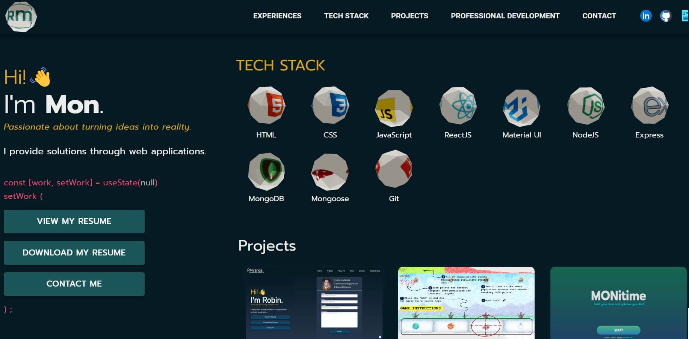

<!-- Improved compatibility of back to top link: See: https://github.com/othneildrew/Best-README-Template/pull/73 -->

<!-- PROJECT LOGO -->
 

<h1 align="center">rmiranda | dev portfolio</h1>

  

    My personal web developer portfolio created during the last weeks of my full stack web development bootcamp at Uplift Code Camp. 
     
    <a href="https://rmiranda-dev-portfolio.onrender.com/" target="_blank" >rmiranda | dev-portfolio</a>
  

<!-- ABOUT THE PROJECT -->

## About The Project

This personal web developer portfolio was developed as the culmination of my
full stack web development bootcamp at Uplift Code Camp. It showcases the
practical application of the knowledge and skills I acquired during the
intensive six-month program. In addition to the core curriculum, I explored and
integrated additional packages and frameworks like Emailjs, Threejs, Material
UI, and various others. These additions enhanced the project by simplifying the
implementation of certain functionalities.

### Built With

- HTML5
- CSS3
- Javascript
- ReactJS
- Material UI
- Threejs

## License

Distributed under the MIT License. See `LICENSE.txt` for more information.

(<a href="#readme-top">back to top</a>)

